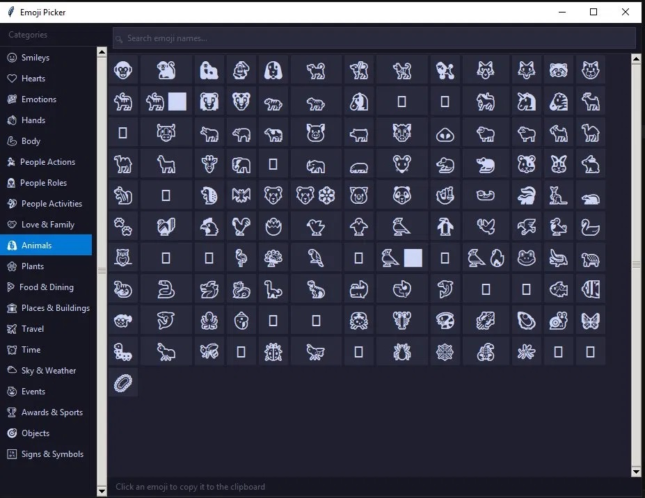

# Custom Emoji Picker for Windows

A lightweight, keyboard-launchable desktop emoji picker for Windows with 20 custom categories, built to make it easier to view and navigate the native Windows emoji keyboard.

## Why I Built This

The Windows emoji keyboard (Win \+ .) splits emojis into only 6 categories, with groupings that don’t apply to the main category (weather under Places, for example). I designed a new 20-category taxonomy \- Smileys, Hearts, Emotions, Hands, Body, People Actions, People Roles, People Activities, People Love & Family, Animals, Plants, Food & Dining, Places & Buildings, Travel, Time, Sky & Weather, Events, Awards & Sports, Objects, and Signs & Symbols \- then built a picker around it.

## Features

* 1,935 emojis across 20 custom categories  
* Base (yellow) \+ light skin tone variants; Will set up skin tone selector in future update
* Click any emoji → copies to clipboard → paste with Ctrl+V  
* Search bar filters by name across all categories  
* Hover shows emoji name in status bar  
* Opens near mouse cursor; closes on Escape or click-away  
* Full support for negative-coordinate multi-monitor setups (secondary monitors left of primary)  
* Launches via Ctrl+Alt+E with included AutoHotkey v2 hotkey binder  
* Compiles to a standalone .exe with PyInstaller

## Tech Stack

* Python 3.14+ / tkinter (no external dependencies for core app)  
* Optional: Pillow for full-color Windows emoji font rendering (pip install pillow)  
* AutoHotkey v2 for hotkey binding  
* Win32 API (ctypes) for reliable clipboard handling

## Setup

1. Clone or download the repo  
2. Run directly: python custom-emoji-keyboard.py  
3. For hotkey launch: install AHK v2, double-click launch\_emoji.ahk, press Ctrl+Alt+E  
4. Optional compile: pyinstaller \--onefile \--windowed custom-emoji-keyboard.py

## Version History

### v1.1 
- Switched emoji grid from Label widgets to tk.Canvas (~10–15× faster render)
- Fixed clipboard: replaced tkinter clipboard with Win32 SetClipboardData/CF_UNICODETEXT
  to correctly handle multi-codepoint emoji sequences
- Fixed Python 3.14 compatibility: removed <MouseWheel> from canvas tag_bind
  (no longer permitted on canvas tags in Tk 8.6+ under Python 3.14)
- Fixed negative-coordinate monitor support (removed max(0,...) clamp)
- Auto-hide scrollbar when content fits without scrolling
- Window now defers first render for near-instant appearance

### v1.0

- Initial build: 1,640 emojis, 20 custom categories  
- Dark theme, sidebar category navigation, search bar  
- AHK v2 hotkey launcher included  
- Positions near mouse cursor on launch

